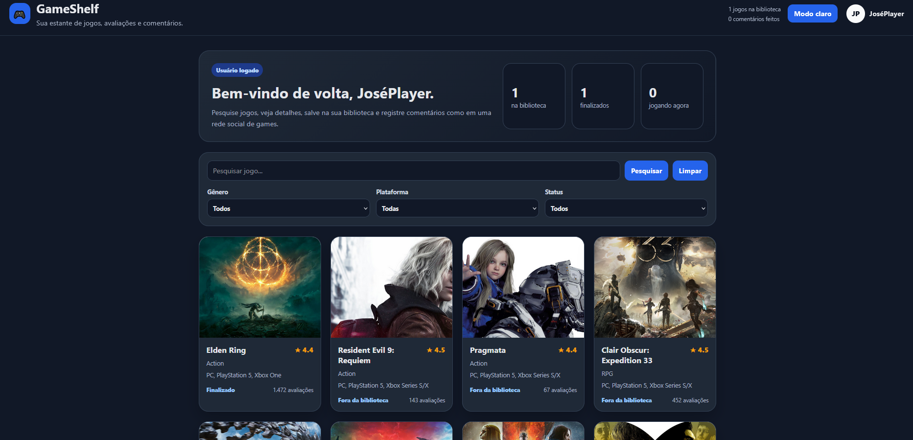

PROJETO: GameShelf

Aplicação usando React + TypeScript para buscar jogos, ver detalhes, avaliar, comentar e salvar status na biblioteca.

>>> Funcionalidades:

- Buscar jogos usando a API da RAWG.
- Exibir lista de jogos.
- Filtrar jogos.
- Abrir modal com detalhes do jogo.
- Exibir informações como nome, imagem, nota e plataformas.
- Adicionar comentários fake.
- Adicionar comentário do usuário.
- Definir status do jogo na biblioteca.
- Avaliar jogo com nota de 1 a 5 estrelas.
- Tema claro e escuro.
- Dados salvos no localStorage.

>>> Tecnologias usadas:

- React.
- TypeScript.
- CSS.
- RAWG API.
- localStorage.
- Vite.

>>> Como rodar o projeto:

- npm install
- npm run dev

>>> Status:

- Projeto finalizado para o portfólio.

>>> Deploy:

https://gameshelf-7bssg59qo-gagaaus-projects.vercel.app/

>>> Screenshot:

>>>>> Autor:

Feito por Gabriel Henrique.